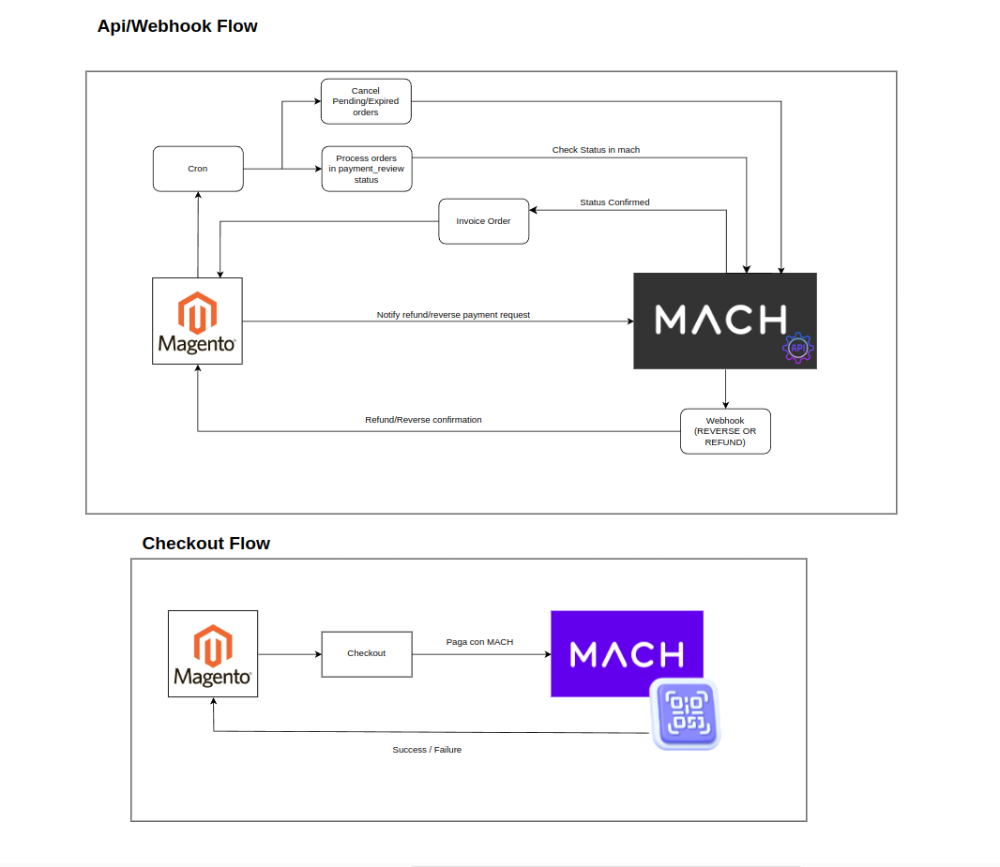

# Improntus MachPay Module for Magento2

### Installation

```sh
$ php bin/magento module:enable Improntus_MachPay --clear-static-content
$ php bin/magento setup:upgrade
$ rm -rf var/di var/view_preprocessed var/cache generated/*
$ php bin/magento setup:static-content:deploy
```

## Description

Improntus MachPay is a payment module for Magento2 that integrates the MachPay payment system into Magento's checkout process. It allows customers to easily perform payments using MachPay.

## Features

- Integration of MachPay as a payment method.
- Allows customers to pay using MachPay.
- Functionality for refunding orders.
- Functionality for cancelling MachPay orders on user's request.
- Supports translations, with a Spanish (Chile) translation already provided.
- Button for cancelling the payment in the checkout process.
- Cron job for cancelling orders that have not been paid after a certain amount of time.
- Cron job for cleaning old qr codes from the server.

## Requirements

- Magento 2.x (tested with 2.4)
- PHP 7.4 or above

## Configuration

Configure the MachPay API credentials in Stores -> Configuration -> Sales -> Payment Methods.

## Payment Process

1. Upon placing an order, a QR code is displayed for MachPay payment.
2. Orders enter the "payment_review" state.
3. Through a cron job, MachPay is queried for the status of transactions in "payment_review."
4. When MachPay confirms payment, the order transitions to "processing," and the corresponding invoice is created.

## Payment Reversal

During the period between order creation and MachPay confirmation, it is possible to reverse payment from MachPay. MachPay notifies Magento through a webhook.

## Refund

After order confirmation in the Magento panel, a button appears to create a refund if needed. This sends a request to MachPay to initiate the refund process. MachPay confirms the refund through a webhook.

## Flowchart



## Author

[](https://www.improntus.com)
